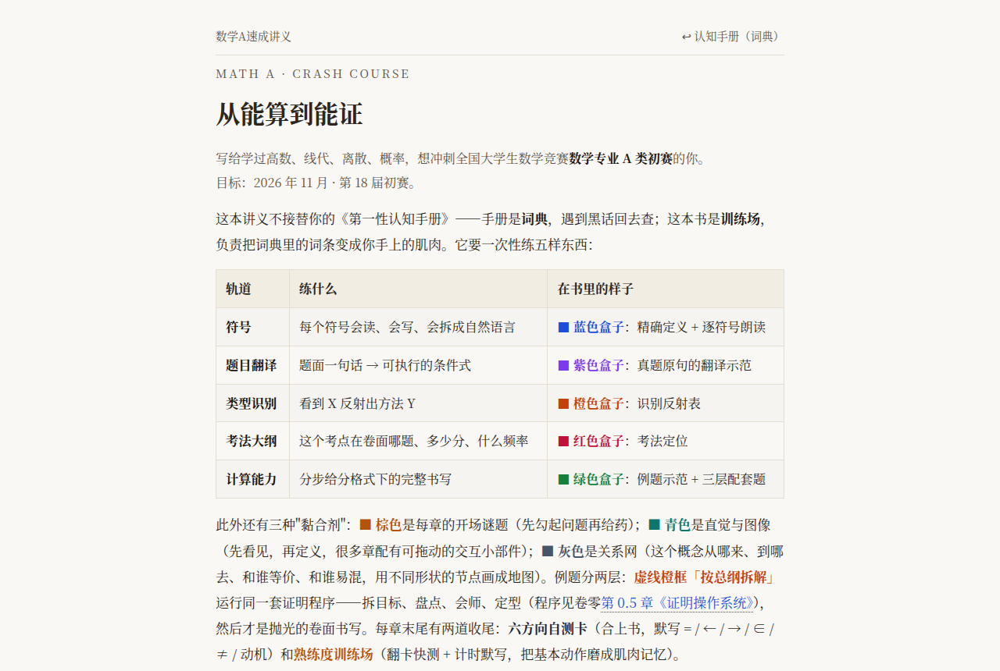
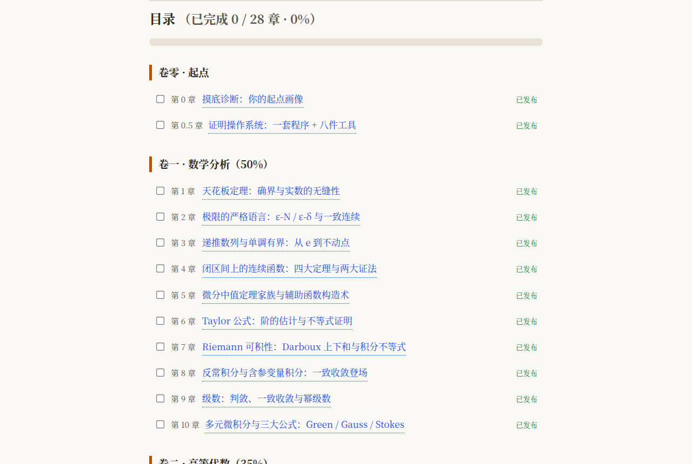
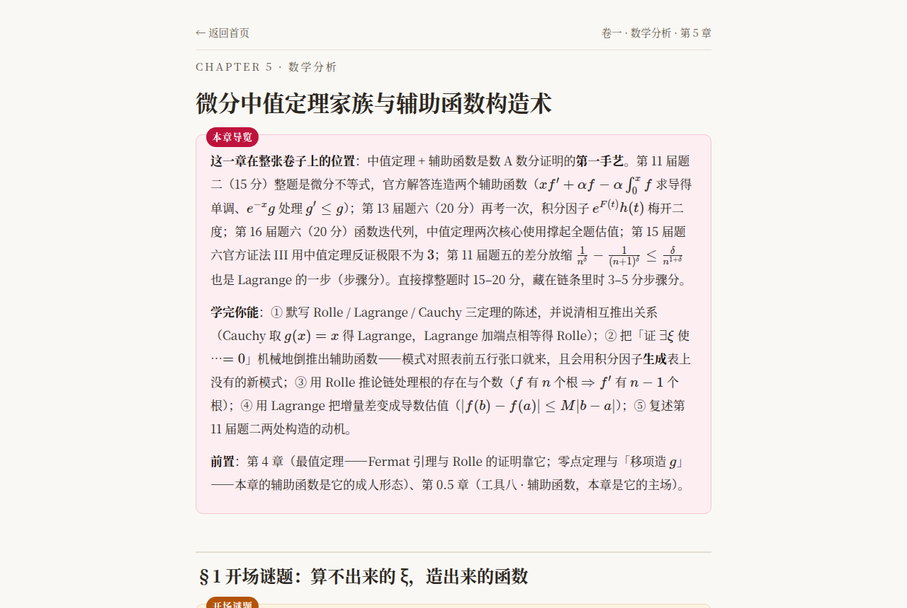
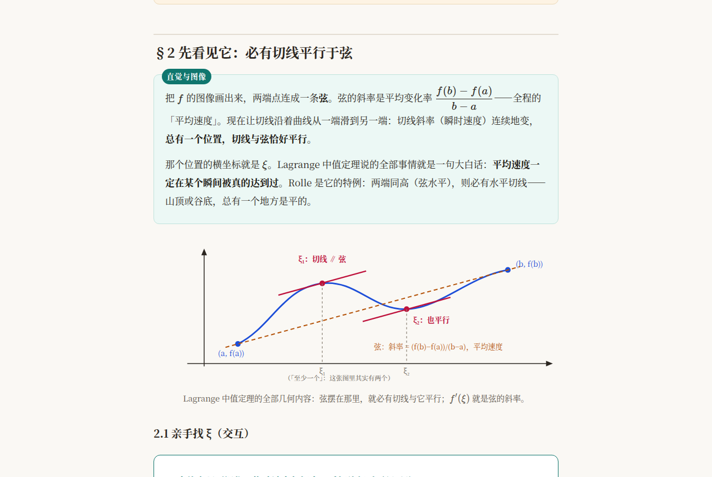
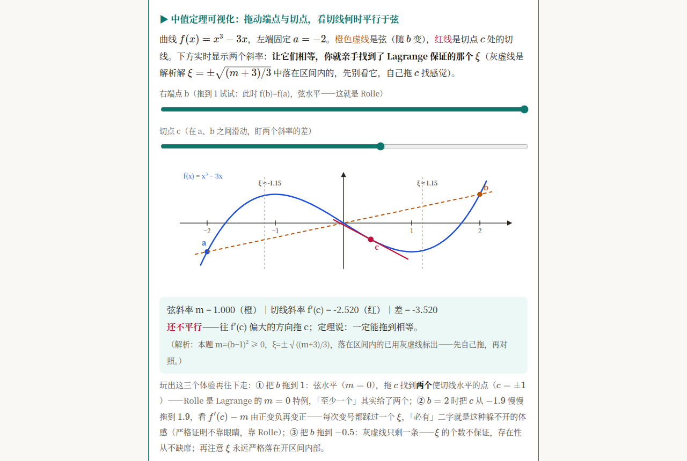
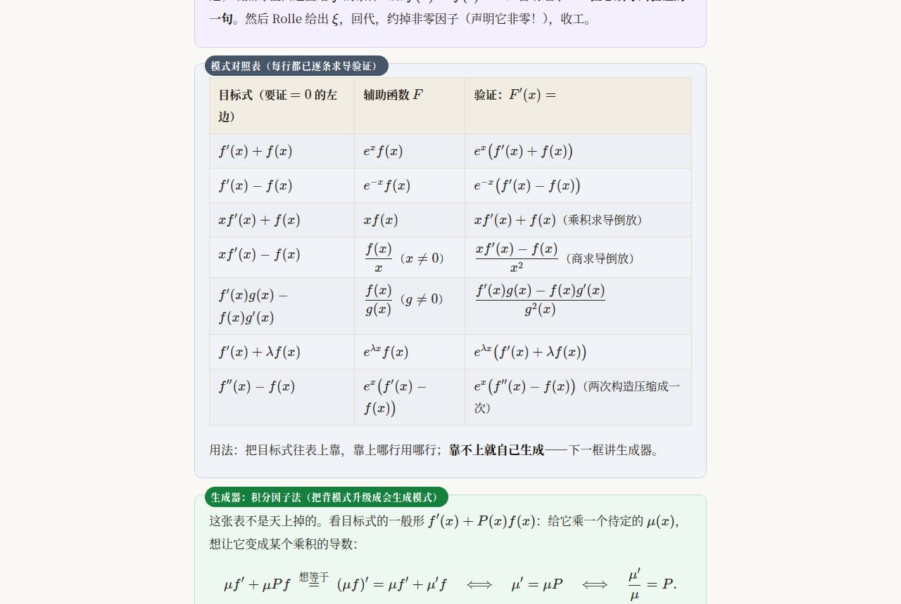
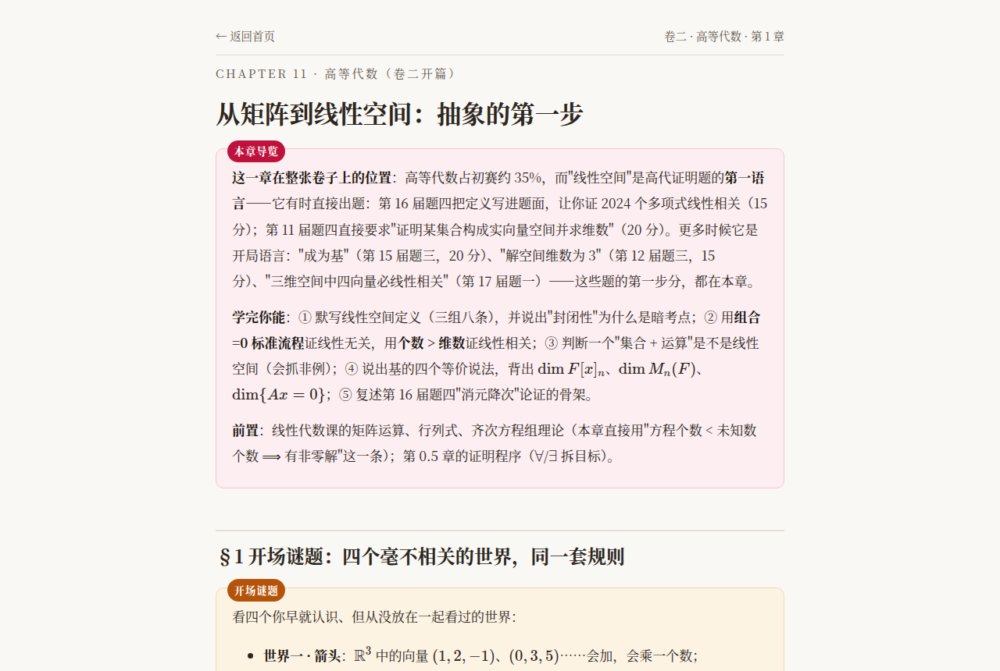
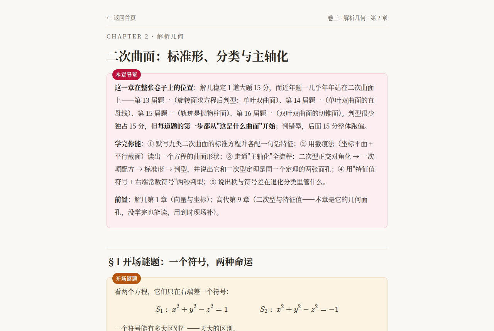
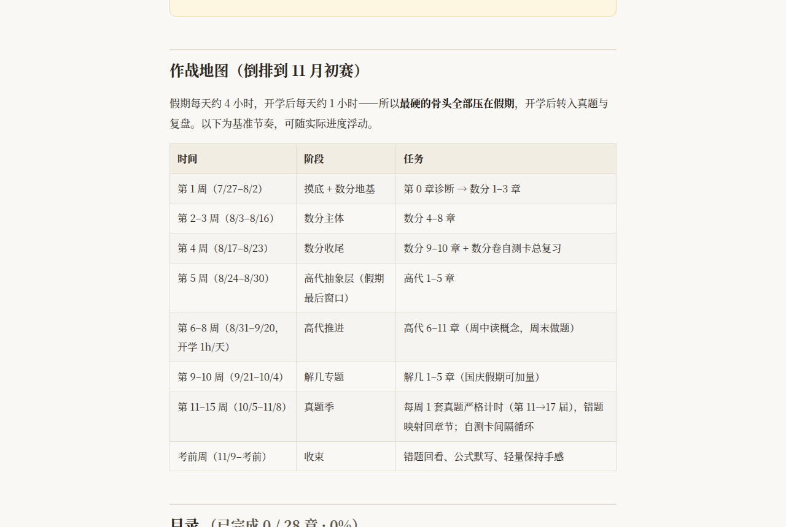

<div align="center">

# 从能算到能证 · 数学A速成讲义

**全国大学生数学竞赛 · 数学专业 A 类初赛 冲刺教材**
目标考试：2026 年 11 月 · 第 18 届初赛

`纯静态 HTML` · `KaTeX 公式` · `零构建` · `即开即学` · `28 章全发布`

[⬇ 快速开始](#-快速开始) ·
[📚 内容地图](#-内容地图四卷-28-章) ·
[🎨 五轨设计](#-五轨训练设计这本书怎么练) ·
[🗺 作战地图](#️-作战地图倒排到-11-月初赛) ·
[🤖 怎么搭配 AI 食用](#-这本书怎么搭配-ai-食用)

</div>

---

> ## 🤖 关于本书 —— 请先读我
>
> 这本书由 **Kimi K3**（AI）编写，作者本人只负责提需求、校对与挑刺。
>
> **⚠️ 它不是一本"系统教材"，而是一份"冲刺型训练手册"，内容是有跳跃的：**
> - 它**假设你学过**高数、线代、离散、概率，默认你认识绝大多数符号；
> - 每个概念只讲**考场上用得到的那一段**，推导常"此处省略"、细节"交给课后"，前后章节之间会突然提速；
> - 有些证明只给**骨架**不给血肉，有些技巧只给**模式**不给来龙去脉；
> - 行文节奏像"老手带你刷题"，不像"新手从零入门"。
>
> **✅ 因此它最适合的吃法是「搭配 AI 一起读」：** 把任意一段丢给 AI，让它"把这一节从头讲一遍 / 补全省略的证明 / 出三道变式题 / 我哪里卡住了你问我三个问题"。AI 是这本书的**外挂说明书**，而这本书是 AI 的**考纲脚手架**。具体怎么用，见 [🤖 这本书怎么搭配 AI 食用](#-这本书怎么搭配-ai-食用)。
>
> 一句话：**别指望一本书自己啃通——把它喂给 AI，才是完整体验。**
>
> <sub>本书为个人冲刺笔记，非官方教材；真题与考点定位基于公开资料整理，仅供学习参考。</sub>

---

## 📖 这本书是什么

> 手册是**词典**，遇到黑话回去查；这本书是**训练场**，负责把词典里的词条变成你手上的肌肉。

它**不重复**你的课本，而是把「全国大学生数学竞赛 · 数学专业 A 类初赛」真正会考的每一块，压缩成**能读、能画、能做、能默写**的训练单元。全书围绕一个目标：

> **让你从"会算"变成"会证"。**

全书 **28 章 + 2 个卷零**，覆盖 **数学分析（占卷面 50%）/ 高等代数（35%）/ 解析几何（15%）** 三大块，并附**第 11–17 届真题逐题考点索引**。

---

## 🚀 快速开始

**方式一 · 直接双击打开（最简单）**

```bash
# 解压 / clone 本仓库后，直接打开讲义首页
open 速成教材/index.html        # macOS
xdg-open 速成教材/index.html    # Linux
start 速成教材\index.html       # Windows
```

> 页面会自动从 CDN 加载 KaTeX 渲染公式，**首次打开需要联网**。之后建议整页 Ctrl/Cmd-S 一次，离线也能看（公式已固化成 HTML）。

**方式二 · 本地起个小服务（推荐，交互部件最稳）**

```bash
cd 速成教材
python3 -m http.server 8000
# 浏览器访问 http://127.0.0.1:8000/index.html
```

**方式三 · GitHub Pages**：仓库开启 Pages 后访问 `/速成教材/index.html`（URL 需对中文路径编码）。

打开后你会看到带**进度勾选**的目录（进度存在浏览器本地 `localStorage`，换设备不共享）：

<div align="center">
  
  <sub>▲ 首页：一眼看清这本书要练的五样东西</sub>
</div>

---

## 📚 内容地图（四卷 · 28 章）

<div align="center">
  
  <sub>▲ 带进度条与完成勾选的目录</sub>
</div>

### 卷零 · 起点
| 章 | 标题 |
| --- | --- |
| 第 0 章 | 摸底诊断：你的起点画像 |
| 第 0.5 章 | **证明操作系统**：一套程序 + 八件工具（全书的"总纲"，例题都跑它） |

### 卷一 · 数学分析（占卷面 50%）
| 章 | 标题 |
| --- | --- |
| 第 1 章 | 天花板定理：确界与实数的无缝性 |
| 第 2 章 | 极限的严格语言：ε-N / ε-δ 与一致连续 |
| 第 3 章 | 递推数列与单调有界：从 e 到不动点 |
| 第 4 章 | 闭区间上的连续函数：四大定理与两大证法 |
| 第 5 章 | 微分中值定理家族与辅助函数构造术 |
| 第 6 章 | Taylor 公式：阶的估计与不等式证明 |
| 第 7 章 | Riemann 可积性：Darboux 上下和与积分不等式 |
| 第 8 章 | 反常积分与含参变量积分：一致收敛登场 |
| 第 9 章 | 级数：判敛、一致收敛与幂级数 |
| 第 10 章 | 多元微积分与三大公式：Green / Gauss / Stokes |

### 卷二 · 高等代数（占卷面 35%）
| 章 | 标题 |
| --- | --- |
| 第 1 章 | 从矩阵到线性空间：抽象的第一步 |
| 第 2 章 | 子空间、和与直和 ⊕ |
| 第 3 章 | 线性映射、核与像：秩-零度定理 |
| 第 4 章 | 表示矩阵与相似：换基的艺术 |
| 第 5 章 | 特征值再认识：几何重数 vs 代数重数 |
| 第 6 章 | Cayley-Hamilton 与最小多项式 |
| 第 7 章 | Jordan 标准形：不可对角化的真相 |
| 第 8 章 | 内积空间：酉、Hermite、正规与谱定理 |
| 第 9 章 | 二次型与正定性：Sylvester 判别 |
| 第 10 章 | 多项式：整除、不可约与数域 |
| 第 11 章 | 高代技巧包：行列式、秩不等式与分块矩阵 |

### 卷三 · 解析几何（占卷面 15%）
| 章 | 标题 |
| --- | --- |
| 第 1 章 | 向量法通解：空间直线与平面 |
| 第 2 章 | 二次曲面：标准形、分类与主轴化 |
| 第 3 章 | 切平面、切锥面与截面：解几最高频家族 |
| 第 4 章 | 旋转曲面与直纹面：直钢丝焊出的双曲面 |
| 第 5 章 | （选学）曲率、挠率与脐点 |

### 附录
- **附录 A · 符号总表与黑话词典**（《第一性认知手册》Part 0.5，见根目录 `数学A类·第一性认知手册.md`）
- **附录 B · 真题考点索引**（第 11–17 届逐题转录，见 `速成教材/真题索引/`）
- **附录 C · 官方考试范围与勾选项**（见根目录 `数学A考试范围与学习清单.md`）

---

## 🎨 五轨训练设计（这本书怎么练）

全书每个知识点都用**五种颜色盒子**固定成五样肌肉，读的时候"看到颜色就知道在练什么"：

<div align="center">

<table>
  <tr>
    <td align="center"><strong>■ 蓝色盒子</strong><br/>符号<br/>精确定义 + 逐符号朗读</td>
    <td align="center"><strong>■ 紫色盒子</strong><br/>题目翻译<br/>真题原句 → 可执行条件式</td>
    <td align="center"><strong>■ 橙色盒子</strong><br/>类型识别<br/>看到 X 反射出方法 Y</td>
  </tr>
  <tr>
    <td align="center"><strong>■ 红色盒子</strong><br/>考法大纲<br/>卷面哪题、多少分、频率</td>
    <td align="center"><strong>■ 绿色盒子</strong><br/>计算能力<br/>分步给分格式下的完整书写</td>
    <td align="center"><strong>■ 棕/青/灰</strong><br/>黏合剂<br/>开场谜题 / 直觉图像 / 关系网</td>
  </tr>
</table>

</div>

每章末尾还有两道"收尾"：**六方向自测卡**（合上书默写 `= / ← / → / ∈ / ≠ / 动机`）+ **熟练度训练场**（翻卡快测 + 计时默写）。

**先看"开场谜题"，再看"直觉与图像"，最后才进定义**——这是全书统一的阅读顺序：先勾起问题 → 先看见图形 → 再给定义 → 再练计算。

<div align="center">
  
  <sub>▲ 每章开头先用红色「本章导览」告诉你这章在卷子上的分量</sub>
</div>

---

## 🖼 内嵌图形与交互小部件

全书配**手绘式 SVG 示意图**（先看见、再定义），很多章还有**可拖动的交互小部件**——直接拉滑杆看定理"动起来"：

<div align="center">
  
  <sub>▲ 直觉与图像：Lagrange 中值定理"必有切线平行于弦"</sub>
</div>

<div align="center">
  
  <sub>▲ 交互小部件：拖动端点 b 与切点 c，实时看弦斜率 vs 切线斜率何时相等</sub>
</div>

公式全部用 **KaTeX** 渲染，排式干净：

<div align="center">
  
  <sub>▲ 橙色「识别反射表」：把"倒推辅助函数"从玄学变成一张可查的表</sub>
</div>

**不同卷的章节同样完整**（下面分别是卷二·高代与卷三·解几的开篇）：

<div align="center">
  
  <sub>▲ 卷二 · 高等代数 · 第 1 章「从矩阵到线性空间」</sub>
</div>

<div align="center">
  
  <sub>▲ 卷三 · 解析几何 · 第 2 章「二次曲面」</sub>
</div>

---

## 🗺️ 作战地图（倒排到 11 月初赛）

<div align="center">
  
</div>

| 时间 | 阶段 | 任务 |
| --- | --- | --- |
| 第 1 周 | 摸底 + 数分地基 | 第 0 章诊断 → 数分 1–3 章 |
| 第 2–3 周 | 数分主体 | 数分 4–8 章 |
| 第 4 周 | 数分收尾 | 数分 9–10 章 + 数分卷自测卡总复习 |
| 第 5 周 | 高代抽象层（假期最后窗口） | 高代 1–5 章 |
| 第 6–8 周 | 高代推进（开学 1h/天） | 高代 6–11 章 |
| 第 9–10 周 | 解几专题 | 解几 1–5 章 |
| 第 11–15 周 | 真题季 | 每周 1 套真题严格计时（第 11→17 届） |
| 考前周 | 收束 | 错题回看、公式默写、保持手感 |

> 假期每天约 4h、开学后约 1h/天，所以**最硬的骨头全压在假期**。此为基准节奏，可随进度浮动。

---

## 🤖 这本书怎么搭配 AI 食用

> 前面说过：**这本书有跳跃，AI 是它的完整体验的一部分。** 下面给几条"开箱即用"的用法。

**1️⃣ 补全被省略的证明**
内容里很多推导写着"此处省略""交给课后"。把那段（连同前后一节）直接贴给 AI：
> "这是《数学A速成讲义》第 X 章的一段，证明跳步了。请把省略的步骤**逐行补全**，并告诉我跳步依赖的前置结论是什么。"

**2️⃣ 把符号/定义讲成人话**
蓝色盒子的"精确定义"是给已经半懂的人收口的。没跟上就：
> "用高中生能懂的话解释这个定义，再给一个具体例子和一个反例。"

**3️⃣ 让它出题 + 判卷**
绿色盒子给了"分步给分格式"。练完让 AI：
> "按本节的题型出 3 道变式题，从易到难。我做完把过程贴给你，你按'分步给分'逐点打分，指出我哪一步扣分。"

**4️⃣ 苏格拉底式自查（最推荐）**
> "我是竞赛选手，刚读完全书第 X 章。你**先别给我答案**，用 5 个问题检验我是否真懂了；我答不上来你再展开讲。"

**5️⃣ 跨章节串联**
书里有"关系网"但很省。想深挖：
> "第 X 章的『…』和第 Y 章的『…』到底什么关系？它们在哪类真题里会同时出现？"

**6️⃣ 错题归因**
每章要求把错题标成 `概念缺口 / 计算失误 / 方法不会 / 时间分配`。让 AI 帮你：
> "这是我错题和我的解答，你判断它属于哪一类，并告诉我该回书里哪一节的哪个盒子重看。"

> 💡 **心法**：书负责**结构与考纲定位**（什么重要、什么题型、什么格式给分），AI 负责**填平跳跃**（把省略的细节讲透）。两者分工，正好互补。

---

## 📁 仓库结构

```
mathA-crash-course/
├── README.md                          # 本文件
├── 数学A类·第一性认知手册.md          # 附录 A：符号总表 + 黑话词典
├── 数学A考试范围与学习清单.md          # 附录 C：官方考试范围与勾选项
├── docs/screenshots/                  # README 用的讲义截图
└── 速成教材/                          # ★ 讲义本体（从这里开始读）
    ├── index.html                     # 首页 / 目录 / 进度
    ├── ch00.html … ch26.html          # 28 章正文
    ├── ch0m.html                      # 第 0.5 章「证明操作系统」
    ├── assets/style.css               # 样式
    ├── assets/quiz.js                 # 自测卡 / 熟练度训练场交互
    ├── 真题索引/                       # 附录 B：第 11–17 届逐题考点索引
    └── 写作规范.md                    # 全书写作体例（供作者/AI 续写参考）
```

---

## ⚙️ 技术细节

- **纯静态**：HTML + 原生 CSS + 原生 JS，**无任何构建步骤、无框架**。
- **公式**：KaTeX（CDN 引入），`$…$` 行内 / `$$…$$` 块级自动渲染。
- **图形**：章节内嵌 **SVG**（示意）+ 少量 **Canvas/DOM 交互小部件**（可拖动）。
- **进度**：目录勾选状态存于浏览器 `localStorage`（键 `mathA-progress`），不上传、不跨设备。
- **兼容**：现代浏览器（Chrome / Edge / Safari / Firefox）。移动端可看，但交互部件建议在桌面端体验。

---

## 📝 署名与免责声明

- **内容编写：Kimi K3（AI）**，人类负责需求、校对、勘误与最终把关。
- 本书为**个人竞赛冲刺笔记**，非出版社教材，也不代表任何官方机构。
- 真题考点定位、考法频率等基于**公开资料**整理，可能存在偏差，请以当年官方通知为准。
- 如用于商业用途或二次传播，请保留 AI 署名并遵守相应许可约定。

<div align="center">

**祝冲刺顺利，考场见分晓。** 🎯

</div>
